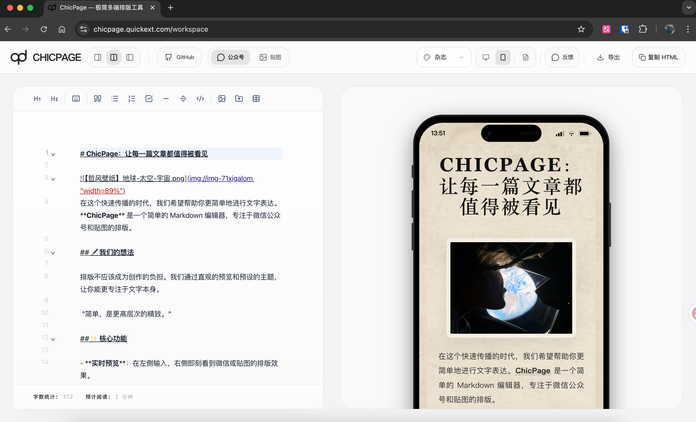

<p align="center">
  
</p>

<h1 align="center">ChicPage</h1>

<p align="center">
  面向中文内容创作者的 Markdown 排版、公众号预览与社媒贴图导出工作台。
</p>

<p align="center">
  <a href="https://chicpage.quickext.com/">在线体验</a>
  ·
  <a href="https://github.com/joekind/chicpage">GitHub 仓库</a>
</p>

<p align="center">
  
  
  
  
</p>

<p align="center">
  
</p>

## 简介

ChicPage 把写作、公众号排版、移动端预览、贴图分页和导出流程放在同一个页面里。你可以用 Markdown 起稿，实时查看不同主题下的排版效果，并把内容复制到发布平台，或导出为 HTML、Markdown、图片压缩包。

## 目录

- [适合场景](#适合场景)
- [功能概览](#功能概览)
- [核心能力](#核心能力)
- [使用流程](#使用流程)
- [本地开发](#本地开发)
- [技术栈](#技术栈)
- [项目结构](#项目结构)
- [使用声明](#使用声明)

## 适合场景

| 场景 | ChicPage 可以做什么 |
| --- | --- |
| 微信公众号长文 | 预览主题样式，一键复制内联 HTML 到公众号编辑器。 |
| Markdown 起稿 | 写作、导入、格式整理、实时预览集中在一个工作台。 |
| 小红书 / 抖音 / TikTok / Twitter 卡片 | 把长文分页成 `3:4`、`9:16`、`1:1` 的贴图素材。 |
| 图文素材整理 | 拖拽图片、调整图片宽度，并随 HTML / Markdown 一起打包导出。 |
| 发布前校对 | 分屏、纯编辑、纯预览模式快速切换，检查 PC / 手机端效果。 |

## 功能概览

| 模块 | 能力 |
| --- | --- |
| Markdown 编辑 | 实时渲染、粘贴 HTML 转 Markdown、撤销重做、本地状态持久化。 |
| 编辑辅助 | 标题、引用、列表、任务清单、代码块、表格、分页符、键盘按键样式。 |
| 公众号排版 | 多主题预览、PC / 手机端预览、复制带内联样式的 HTML。 |
| 贴图模式 | 自动分页、手动分页、比例切换、主题切换、字体切换、导出预览。 |
| 图片处理 | 拖拽插入、IndexedDB 本地存储、压缩、宽度调整、导出资源打包。 |
| 导入导出 | 导入 `.md` / `.markdown`，导出 HTML、Markdown、贴图图片 zip。 |

## 核心能力

### Markdown 写作

- 支持分屏、纯编辑、纯预览三种布局。
- 支持粘贴 HTML 并转换为 Markdown。
- 支持撤销、重做和本地状态持久化。
- 支持字数统计与预计阅读时间。
- 支持右键菜单快速插入链接、图片、标题、分隔线和分页符。

### 编辑辅助

- 快捷插入标题、引用、无序列表、有序列表、任务清单、代码块。
- 支持键盘按键样式 `<kbd>`。
- 支持表格尺寸选择器。
- 支持一键中英文空格整理。
- 支持 `<!--pagebreak-->` 强制分页。

### 图片处理

- 拖拽图片到编辑区后，自动插入 Markdown 图片语法。
- 本地图片会压缩后存入 IndexedDB，刷新页面后仍可继续使用。
- 预览区支持直接调整图片宽度。
- 导出 HTML / Markdown 时，会尽量把图片一起打包到 `images/` 目录。
- 外链图片导出时会先尝试直接读取，失败后使用内置图片代理兜底。

### 公众号排版

- 内置多套微信公众号主题：默认、暖纸、纸质、杂志、手绘。
- 支持 PC / 手机端预览。
- 支持一键复制带内联样式的 HTML，方便粘贴到公众号编辑器。
- 支持导出 HTML 或 Markdown。
- 内容包含图片时，导出为 zip，包含主文件和图片资源。

### 贴图模式

- 支持 `3:4`、`9:16`、`1:1` 三种比例。
- 支持多页自动分页和 `<!--pagebreak-->` 手动分页。
- 支持贴图主题切换。
- 支持字体切换：系统默认、思源黑体、思源宋体、仓耳今楷、霞鹜文楷、站酷酷黑、智芒星、Newsreader、Open Sans、Inter、JetBrains Mono、Bebas Neue。
- 支持导出前预览所有分页。
- 支持批量导出图片压缩包。

### 导入与导出

- 导入本地 `.md` / `.markdown` 文件。
- 导出 HTML，保留样式和图片资源。
- 导出 Markdown，包含图片资源。
- 导出贴图图片 zip。
- 导出文件名自动附带时间戳，例如 `ChicPage-20260427-153012.zip`，避免重复覆盖。

## 使用流程

```text
写作 / 导入 Markdown
        ↓
选择公众号排版或贴图模式
        ↓
切换主题、设备、比例或字体
        ↓
插入图片、表格、分页符，调整图片宽度
        ↓
复制到发布平台，或导出 HTML / Markdown / 图片 zip
```

## 本地开发

### 环境要求

- Node.js 20+
- npm

### 启动项目

```bash
git clone https://github.com/joekind/chicpage.git
cd chicpage
npm install
npm run dev
```

启动后访问：

```bash
http://localhost:3000/workspace
```

### 常用脚本

| 命令 | 说明 |
| --- | --- |
| `npm run dev` | 启动本地开发服务。 |
| `npm run build` | 构建生产版本。 |
| `npm run start` | 启动生产服务。 |
| `npm run lint` | 运行 ESLint 检查。 |

## 技术栈

| 类型 | 技术 |
| --- | --- |
| 应用框架 | Next.js 16, React 19 |
| 语言 | TypeScript |
| 样式与动效 | Tailwind CSS, Framer Motion |
| 状态管理 | Zustand |
| 编辑器 | CodeMirror |
| Markdown 渲染 | Unified, Remark, Rehype |
| 代码高亮 | Highlight.js |
| 图片导出 | html-to-image |
| 压缩包 | JSZip |

## 项目结构

```text
app/                          Next.js App Router 页面与 API
components/workspace/          工作台 UI、编辑器、预览区、工具栏
hooks/                         Markdown 同步、快捷键、导出相关 Hook
lib/                           Markdown 渲染、主题、图片服务、导出工具
store/                         Zustand 全局状态与持久化
public/                        Logo、示例图、背景纹理等静态资源
types/                         类型定义
```

## 使用声明

ChicPage 采用自定义的个人免费许可证，详见 [LICENSE](./LICENSE)。

- 个人写作、学习、非商业内容创作：免费使用。
- 个人可以 fork、阅读、学习和修改源码。
- 未经授权，不允许用于商业产品、SaaS 服务、企业内部工具、二次销售或付费部署。
- 商业使用请先获得作者授权。
- 使用、复制、修改或分发时需要保留版权声明和许可证声明。

## 说明

ChicPage 仍在持续迭代中，当前重点是中文写作、公众号排版和社媒贴图导出。欢迎提交 issue 或 PR。
