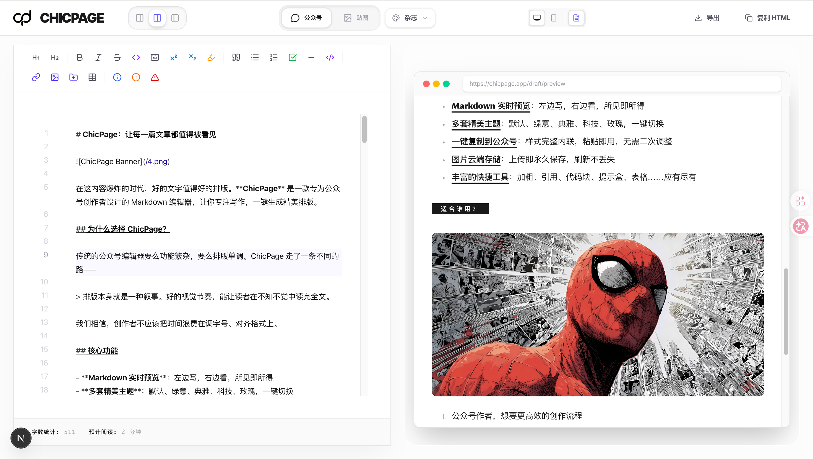
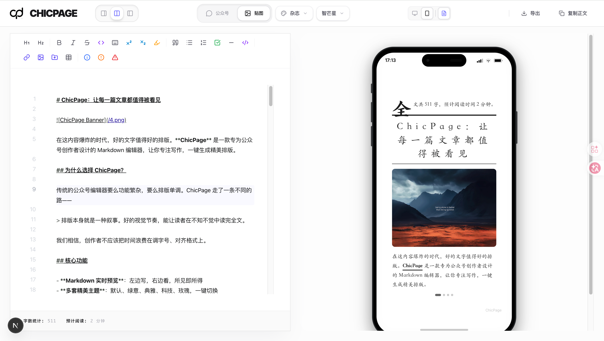

# ChicPage — The Art of Typography for Social Media

<p align="center">
  
</p>

<p align="center">
  <strong>次世代排版引擎 // 专为微信公众号与小红书设计的沉浸式创作工具</strong>
</p>

<p align="center">
  <a href="#features">功能特性</a> •
  <a href="#tech-stack">技术栈</a> •
  <a href="#getting-started">快速开始</a> •
  <a href="#community">加入社区</a>
</p>

---

## 🖋️ 愿景：重塑数字时代的表达

**ChicPage** 不仅仅是一个排版工具，它是文字的艺术容器。在碎片的社交媒体时代，我们追求将精湛的排版控制与现代化的 AI 生产力相结合，为创作者提供一个极简、直观且具有视觉冲击力的表达舞台。

## ✨ 功能特性 (Key Features)

- **🎨 大师级视觉主题**: 内置多套经过精确数学计算的微信公众号排版方案，支持一键切换。
- **📸 小红书卡片引擎**: 全球首创的卡片式切图算法，将 Markdown 文本无缝转换为精美的小红书海报。
- **🍱 Bento 智能布局**: 采用现代网格系统（Bento Grid），自动优化图片与文字的排列比例。
- **⚡ 实时 Markdown 动力**: 基于沉浸式编辑体验，支持 GFM 扩展与实时多端预览。
- **🌓 响应式工作区**: 提供“分屏”、“纯净编辑”与“真机预览”多种工作模式，完美适配创作者的工作流。
- **🧩 高级交互组件**: 支持 Tip 盒、警告框、自定义荧光笔标注等高级排版元素。

## 🛠️ 技术栈 (Tech Stack)

ChicPage 采用了前沿的 Web 技术架构，确保极致的流畅性与可维护性：

- **Framework**: [Next.js 15+](https://nextjs.org/) (App Router)
- **Styling**: [Tailwind CSS v4](https://tailwindcss.com/) & [Vanilla CSS Utility]
- **Animation**: [Framer Motion](https://www.framer.com/motion/)
- **Icons**: [Lucide React](https://lucide.dev/)
- **Typography**: [Inter](https://fonts.google.com/specimen/Inter) & [Outfit](https://fonts.google.com/specimen/Outfit)
- **Deployment**: Optimized for [Vercel](https://vercel.com/)

## 🚀 快速开始 (Getting Started)

确保您的开发环境中安装了 `Node.js 18+`。

### 1. 克隆并安装
```bash
git clone https://github.com/joekind/chicpage.git
cd chicpage
npm install
```

### 2. 启动开发服务器
```bash
npm run dev
```
访问 `http://localhost:3000` 即可开始创作。

## 📸 预览 (Preview)

| 落地页 (Landing Page) | 编辑器 (Editor Workspace) |
| :---: | :---: |
|  |  |

## 🤝 加入社区 & 交流支持 (Community)

扫描下方二维码，关注我们的**官方微信公众号**。获取最新的主题更新、排版教程以及开源动态。

<p align="center">
  
</p>

---

## 📜 许可证 (License)

本项目基于 **MIT License** 开源。在个人与商业化实践中，欢迎自由引用。

---

<p align="center">
  Made with 🖤 by <a href="https://github.com/your-username">ChicPage Labs</a>
</p>
