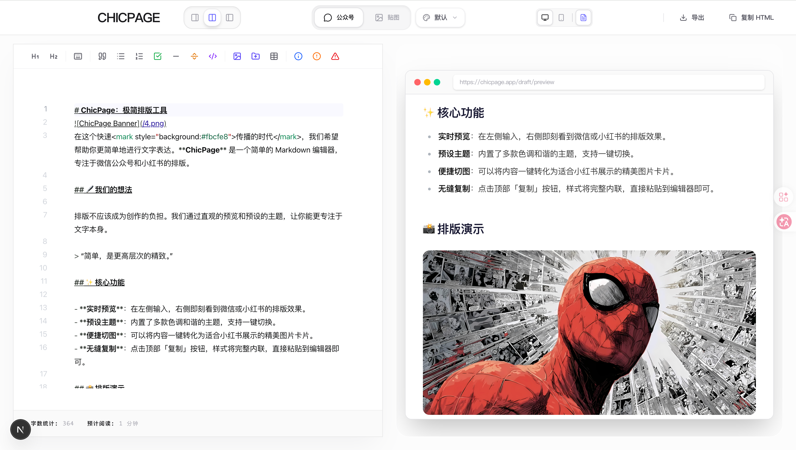

# ChicPage

<p align="center">
  
</p>

一个为中文内容创作者打造的 Markdown 写作、排版与贴图导出工具。

ChicPage 希望把内容创作到发布前的关键链路，收敛到一个足够轻、足够顺手的工作台里：
- 写 Markdown
- 做公众号排版
- 预览不同平台内容效果
- 导出适配社媒平台的贴图素材

## 在线地址

- 产品地址：https://chicpage.quickext.com/
- 仓库地址：https://github.com/joekind/chicpage

## 适合谁用

如果你是以下类型的内容创作者，ChicPage 会比较适合你：
- 公众号作者
- 知乎答主
- 小红书 / 抖音 / TikTok / Twitter / Facebook 等社媒内容创作者
- 习惯先用 Markdown 起稿，再整理成正式发布内容的人

## 你可以用 ChicPage 做什么

### 1. Markdown 写作与实时预览
- 支持 Markdown 输入与实时渲染
- 支持编辑区 / 预览区 / 分栏三种工作模式
- 支持基础编辑辅助与快捷键操作
- 支持撤销、重做与内容同步

### 2. 公众号排版
- 支持公众号文章排版预览
- 支持主题切换
- 支持字号、图片圆角等常用展示参数调整
- 支持一键复制排版结果

### 3. 多平台贴图模式
- 支持 `3:4`、`9:16`、`1:2` 三种贴图比例
- 支持多页贴图预览、翻页与导出预览
- 支持贴图主题切换
- 支持贴图字体切换
- 支持封面头部、底部信息显示开关
- 适配微信公众号、小红书、抖音、TikTok、Twitter、知乎、Facebook 等内容发布场景

### 4. 导入与导出
- 支持导入本地 Markdown 文件
- 支持导出贴图图片
- 支持在导出前查看预览结果
- 支持导出 HTML、Markdown 或图片压缩包

### 5. 使用体验
- 提供快捷键说明面板
- 首页提供加载动画、骨架屏与基础动效反馈
- 本地状态持久化，刷新后可保留主要编辑状态

## 核心流程

1. 导入或编写 Markdown 内容
2. 选择主题、字体与展示方式
3. 预览公众号排版或贴图效果
4. 导出可发布的排版稿或社媒内容素材

## 本地开发

```bash
git clone https://github.com/joekind/chicpage.git
cd chicpage
npm install
npm run dev
```

## 技术栈

- Next.js
- React
- Tailwind CSS
- Framer Motion
- Zustand

## 说明

项目还在持续整理和迭代中。
