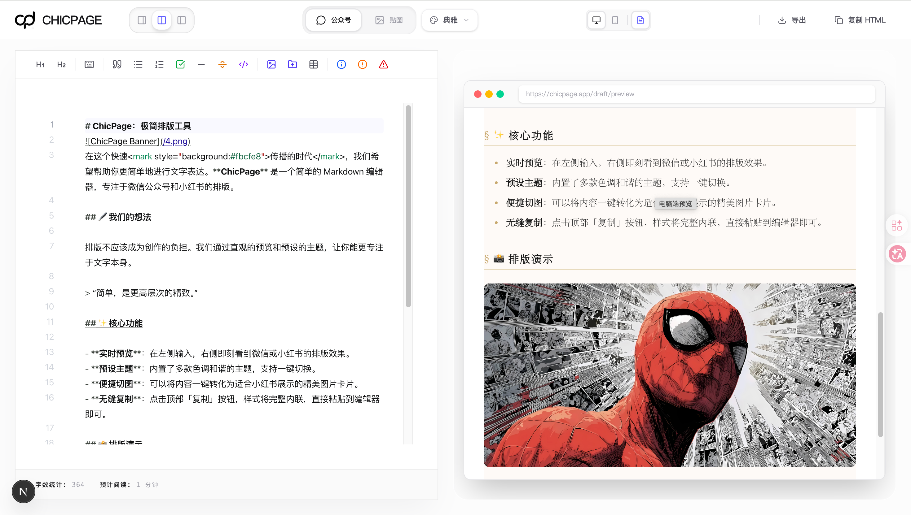
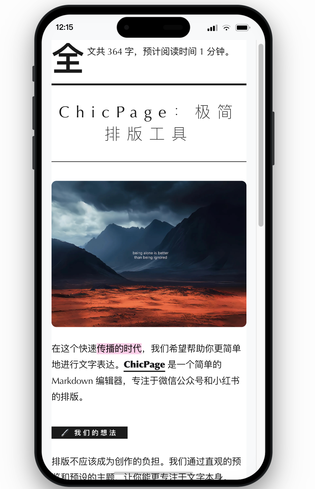
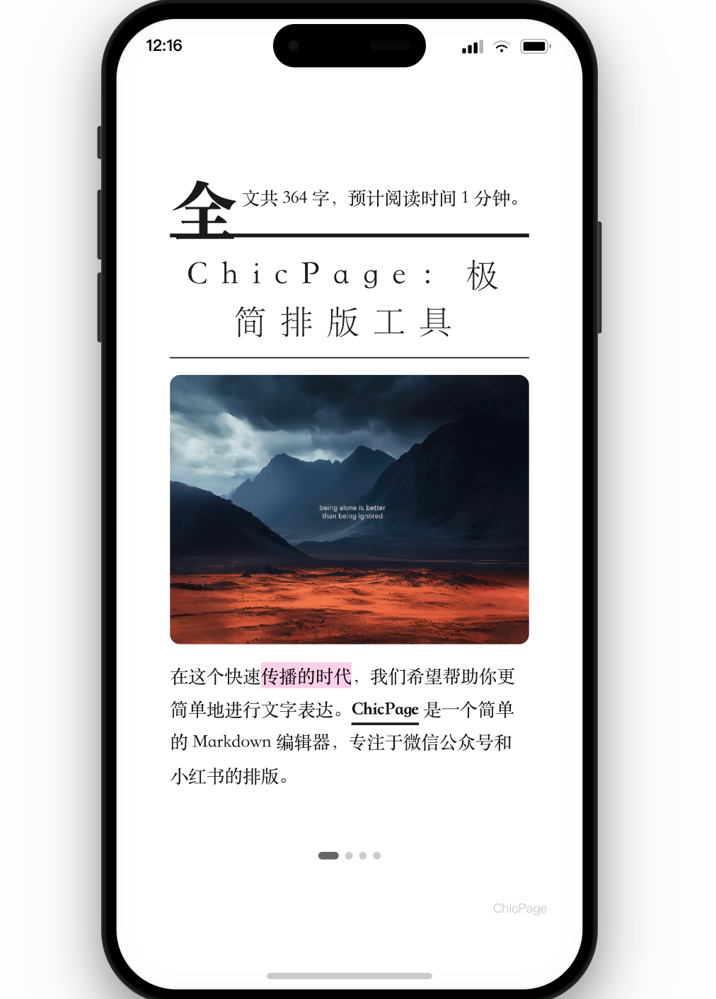

# 🖋️ ChicPage — 极致极简的排版生产力

<p align="center">
  
  
  
</p>

<p align="center">
  <strong>让每一行文字，都散发优雅。专为微信公众号与小红书设计的 Markdown 排版利器。</strong>
</p>

<p align="center">
  <a href="http://chicpage.quickext.com/"><strong>🚀 立即在线使用</strong></a> | 
  <a href="https://github.com/joekind/chicpage/stargazers">✨ 给个 Star </a> | 
  <a href="https://github.com/joekind/chicpage/issues">🐞 提交反馈</a>
</p>

<p align="center">
  
</p>

---

## 🖋️ 愿景：重塑文字资产的质感

在信息爆炸的社交媒体时代，内容的**“视觉传达”**与文字本身同样重要。**ChicPage 并不是一个简单的编辑器**，它是我们对“数字排版美学”的一种追求。我们希望创作者能从繁琐的 HTML 标签和复杂的编辑器中解放出来，回归到 Markdown 的纯粹与专注。

---

## ✨ 核心特性 

### 🎨 极致多端排版 (Multi-Platform Artistry)
不仅是微信公众号，我们会慢慢适配 **掘金 (Juejin)**、**知乎 (Zhihu)**、**Medium**、**Twitter (X)** 等主流文字平台。一键复制，样式完美迁移，告别手动调整。

### 🍱 智能全能贴图引擎 (All-in-One Poster Engine)
 **小红书 (XHS)**、**抖音 (Douyin)**、**推特 (X)** 社交媒体设计的语义级切图逻辑。不仅支持横竖屏自由比例，更能智能分析文字段落，自动生成高传播力的视觉卡片。

### 📁 一键 MD 导入 (Quick MD Import)
支持本地 Markdown 文件直接导入。无论是你沉淀已久的笔记，还是在 Obsidian/Typora 撰写的长文，都能在 ChicPage 中瞬间“优雅化”。

### 🖋️ 沉浸式创作空间 (Focused Space)
全沉浸式写作体验，支持 PC 与 Mobile 模型机实时切换预览。所见即所得，不仅是口号，更是生产力。

### ⚡ 零负担 
- **无需注册**：打开即用。
- **隐私至上**：本地存储，内容永不上传云端。
- **秒级响应**：基于 Next.js 极致优化。

---

## 🛠️ 技术底座 (Infrastructure)

| Core | Styles | Motion | Store |
| :--- | :--- | :--- | :--- |
| **Next.js 16** | **Tailwind CSS** | **Framer Motion** | **Zustand** |
| React 生态顶配 | 极致原子化样式 | 电影级平滑过渡 | 轻量响应式状态 |

---

## 📸 视觉预览 (Visual Preview)

<p align="center">
  
</p>

<div align="center">
  <table>
    <tr>
      <td></td>
      <td></td>
    </tr>
  </table>
</div>

---

## 🚀 快速上手 (Quick Run)

```bash
# 1. 下载项目
git clone https://github.com/joekind/chicpage.git

# 2. 准备运行
npm install

# 3. 开启优雅
npm run dev
```

---

## 🤝 创作者社区 (Community)

扫描下方二维码，加入 ChicPage 创作者社区。获取最新的设计灵感与排版方案。

<p align="center">
  
</p>

---

<p align="center">
  Made with 🖤 by <strong><a href="http://chicpage.quickext.com/">ChicPage Labs</a></strong>
</p>
