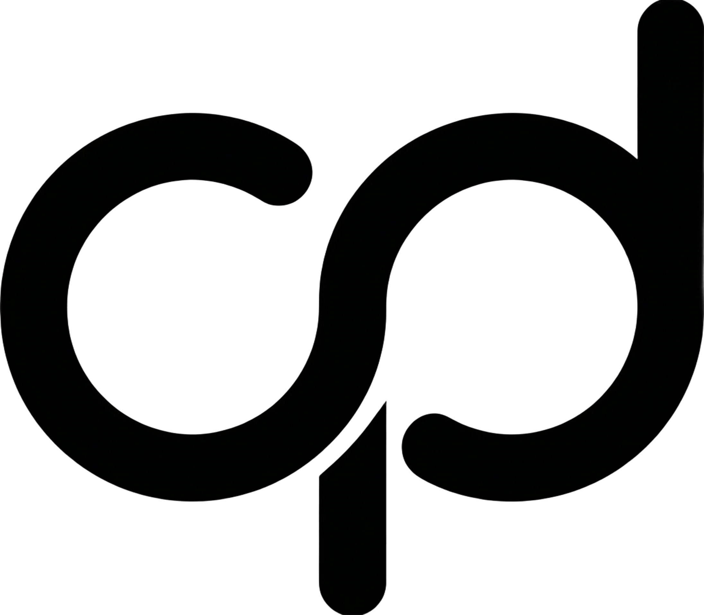

# ChicPage：探索排版的纯粹魅力

> “排版是文字的灵魂。它不仅仅是指引阅读，更是在构建情感的容器。” —— ChicPage 设计团队

在本示例中，我们将为您展示 ChicPage 核心排版引擎支持的所有主要功能。您可以将此内容粘贴到您的演示器中查看效果。

## 01. 基础样式 (Basic Style)

这是一段普通的正文描述。我们支持 **加粗文本 (Bold)** 以突出重点，也支持 *斜体 (Italic)* 来表达微妙的语气。当然，您也可以使用 ~~删除线 (Strikethrough)~~。

如果您正在编写技术文档，可以随时插入 `<kbd>Ctrl</kbd>` + `<kbd>C</kbd>` 这样的按键样式，或者使用 `<mark style="background:#fef08a">荧光笔标注 (Highlight)</mark>` 来手动标记重点内容。

---

## 02. 高级标注组件 (Admonitions)

ChicPage 针对微信公众号与小红书进行了深度优化，支持三级语义化标注盒：

:::tip
**温馨提示 (Tip)**
这里适合放置一些补充性的建议或小技巧，默认呈现柔和的蓝色调。
:::

:::warning
**注意事项 (Warning)**
这里适合说明一些操作边界或需要关注的细节。
:::

:::danger
**重大警告 (Danger)**
请确保读者不会遗漏这里的关键风险，通常呈现警示性红色。
:::

---

## 03. 结构化数据 (Structured Data)

### 列表展示
*   **智能分页算法**：自动处理长文在不同端的展示。
*   **动态排版方案**：支持 10+ 套精美主题。
*   **跨端同步预览**：
    1.  桌面端网页预览
    2.  移动端真机高度还原
    3.  小红书长图导出

### 数据表格
| 核心指标 | 功能描述 | 状态 |
| :--- | :--- | :---: |
| 渲染速度 | 支持毫秒级实时热更新 | ✅ |
| 主题支持 | 公众号 & 小红书双模 | ✅ |
| 导出质量 | 4K 极清切图导出 | 🚀 |

---

## 04. 媒体与代码 (Media & Code)

### 技术演示
您可以插入精美的代码块，支持多种语言高亮：

```javascript
// ChicPage Core Logic
const renderMagic = (content) => {
  return content.split('\n')
    .map(line => `✨ ${line}`)
    .join('\n');
};

console.log(renderMagic("Hello World"));
```

### 图片与引用


*注：在编辑器中，您可以直接拖拽图片进行智能缩放。*

---

## 05. 社交媒体特性 (Social Optimized)

在小红书模式下，您的文档将自动被切分为 **Bento Grid** 风格的卡片流。

- **多行文本块**：支持长句在卡片中的自动对齐。
- **引用样式**：呈现杂志感的大字引用。
- **多图拼贴**：支持多张图片在同一卡片内的黄金比例排列。

---

<p align="center">
  <em>—— 感谢使用 ChicPage，开启您的专业创作之旅 ——</em>
</p>
